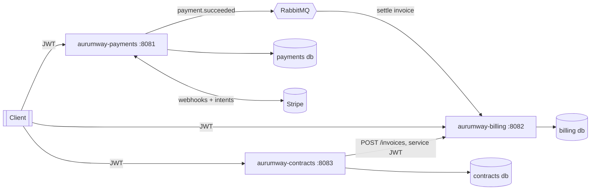
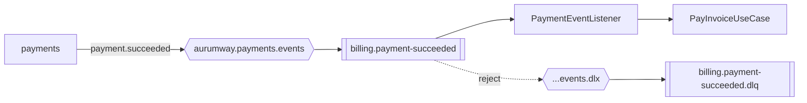

# Aurumway

B2B billing & payments platform built as three independent **Spring Boot** microservices following **hexagonal / clean architecture**. Each service owns its database, exposes a stateless JWT-secured REST API, is multi-tenant, and keeps an append-only audit trail.

| Service | Port | Database | Responsibility |
|---------|------|----------|----------------|
| **aurumway-payments** | 8081 | `payments` | Stripe payment intents, payments, refunds, webhooks |
| **aurumway-billing** | 8082 | `billing` | Customers, invoice lifecycle, double-entry ledger, reports, bank-statement import & reconciliation |
| **aurumway-contracts** | 8083 | `contracts` | Contract lifecycle and recurring invoice generation (calls billing) |

---

## Table of contents

- [Architecture](#architecture)
- [Tech stack](#tech-stack)
- [Quick start (Docker Compose)](#quick-start-docker-compose)
- [Local development](#local-development)
- [Configuration](#configuration)
- [Authentication & RBAC](#authentication--rbac)
- [API overview](#api-overview)
- [Cross-cutting concerns](#cross-cutting-concerns)
- [Health checks](#health-checks)
- [Testing](#testing)
- [CI/CD](#cicd)
- [Project layout](#project-layout)
- [Roadmap](#roadmap)

---

## Architecture

Each service is structured in concentric layers — the domain has no framework dependencies, and infrastructure plugs in through ports/adapters.

```
adapter/in/api        → REST controllers (DTOs, HTTP)
adapter/in/webhook    → external callbacks (Stripe)
        │
application/port/in   → use-case interfaces
application/usecase   → command handlers (orchestration)
application/port/out  → outbound interfaces (persistence, integrations)
        │
domain/model          → aggregates & state machines (pure Java)
domain/service        → domain services (ledger, reconciliation)
        │
adapter/out/persistence → JPA entities, repositories, Flyway
adapter/out/integration → Stripe, inter-service RestClient
```

System view:



> **Inter-service communication:**
> - **Synchronous (REST):** `contracts` calls `billing` to generate invoices, using a short-lived service JWT (`contracts-service`, `FINANCE` role) that carries the caller's tenant.
> - **Asynchronous (RabbitMQ):** when a payment succeeds, `payments` publishes a `payment.succeeded` event; `billing` consumes it and settles the referenced invoice. See [Async messaging](#async-messaging).

---

## Tech stack

- **Java 21**, **Spring Boot 3.x** (Web, Security, Data JPA, Actuator)
- **PostgreSQL 16** + **Flyway** migrations (one schema per service)
- **JWT** (jjwt) for stateless auth, **BCrypt** for credentials
- **Stripe** Java SDK (payment intents, refunds, webhook verification)
- **Hibernate `@Filter`** for row-level multi-tenancy
- **Spring AOP** for the audit trail
- **Maven** multi-module reactor (wrapper included at repo root)
- **JUnit 5**, **AssertJ**, **Testcontainers** (integration tests)
- **Docker** multi-stage builds, **Docker Compose** orchestration
- **GitHub Actions** CI

---

## Quick start (Docker Compose)

Requires Docker. Brings up the three databases, RabbitMQ, and all three services.

```bash
docker compose up -d --build
```

The stack boots with safe development defaults (no `.env` required). Verify everything is healthy:

```bash
curl -s localhost:8081/actuator/health   # payments
curl -s localhost:8082/actuator/health   # billing
curl -s localhost:8083/actuator/health   # contracts
# → {"status":"UP","groups":["liveness","readiness"]}
```

Smoke test (login → create + issue an invoice):

```bash
TOKEN=$(curl -s -X POST localhost:8082/auth/login \
  -H 'Content-Type: application/json' \
  -d '{"username":"admin","password":"admin","tenantId":"acme-corp"}' \
  | sed -E 's/.*"token":"([^"]+)".*/\1/')

# create a customer
CUSTOMER=$(curl -s -X POST localhost:8082/customers \
  -H "Authorization: Bearer $TOKEN" -H 'Content-Type: application/json' \
  -d '{"name":"Globex","email":"ap@globex.com","taxId":"99-0000000"}')

echo "$CUSTOMER"
```

Tear down:

```bash
docker compose down          # keep volumes
docker compose down -v       # wipe databases too
```

> To use real Stripe keys, copy `.env.example` to `.env` and fill `STRIPE_SECRET_KEY` / `STRIPE_WEBHOOK_SECRET`. Without them the payments service still boots; the Stripe webhook endpoint returns `503` until configured.

---

## Local development

Run the full reactor build (unit + integration tests) from the repo root:

```bash
./mvnw -B verify
```

Run a single service against a local Postgres (start just the DBs via compose, then):

```bash
# example: payments
./mvnw -pl aurumway-payments spring-boot:run
```

Build one module only:

```bash
./mvnw -pl aurumway-billing clean package
```

---

## Configuration

All environment-specific settings are externalized. Defaults are baked into each `application.properties` so the app runs locally without extra setup; override via environment variables (or a root `.env` for Docker Compose). See [`.env.example`](.env.example) for the full list.

Key variables:

| Variable | Purpose | Default |
|----------|---------|---------|
| `JWT_SECRET` | HMAC signing secret (**override in production**) | insecure dev value |
| `JWT_EXPIRATION_HOURS` | Token TTL | `24` |
| `ALLOWED_TENANTS` | Comma-separated tenants accepted at login | `acme-corp,globex-inc,default` |
| `STRIPE_SECRET_KEY` / `STRIPE_WEBHOOK_SECRET` | Stripe credentials (payments) | empty |
| `<SVC>_DB_URL` / `_USERNAME` / `_PASSWORD` | Per-service datasource | per `docker-compose.yml` |
| `BILLING_SERVICE_URL` | Downstream billing base URL (contracts) | `http://localhost:8082` |
| `DB_POOL_MAX_SIZE`, `DB_POOL_MIN_IDLE`, … | HikariCP tuning | `10` / `2` / … |
| `ACTUATOR_ENDPOINTS` | Exposed actuator endpoints | `health,info,metrics` |
| `ACTUATOR_HEALTH_DETAILS` | Health detail visibility | `when_authorized` |

> **Secrets:** `.env` is git-ignored; only `.env.example` (placeholders) is committed.

---

## Authentication & RBAC

Stateless JWT. Authenticate, then send `Authorization: Bearer <token>` on every protected call. The tenant is **selected at login** (`tenantId` in the body) and embedded in the token — there is no separate tenant header.

```bash
curl -X POST localhost:8082/auth/login \
  -H 'Content-Type: application/json' \
  -d '{"username":"admin","password":"admin","tenantId":"acme-corp"}'
```

In-memory users (identical across all three services, dev only):

| Username | Password | Role | Typical access |
|----------|----------|------|----------------|
| `admin` | `admin` | `ADMIN` | All mutations + audit events + actuator |
| `finance` | `finance` | `FINANCE` | Business writes (payments, invoices, statements, invoice generation) |
| `viewer` | `viewer` | `VIEWER` | Read-only |

Public routes: `/auth/**`, `/actuator/health/**`, `/error`, and (payments) `/webhooks/**`.

---

## API overview

Each service ships interactive **OpenAPI 3 / Swagger UI** docs (springdoc). Use the **Authorize** button with a JWT from `/auth/login` to call secured endpoints.

| Service | Swagger UI | OpenAPI JSON |
|---------|-----------|--------------|
| payments | http://localhost:8081/swagger-ui.html | `/v3/api-docs` |
| billing | http://localhost:8082/swagger-ui.html | `/v3/api-docs` |
| contracts | http://localhost:8083/swagger-ui.html | `/v3/api-docs` |

Full path is root-relative (no context path). Below is a condensed map; see each module's `*Controller` for request/response DTOs.

### aurumway-payments (8081)

| Method | Path | Roles | Notes |
|--------|------|-------|-------|
| POST | `/auth/login` | public | |
| POST | `/payment-intents` | ADMIN, FINANCE | **`Idempotency-Key` required**; creates Stripe intent |
| POST | `/payments` | authenticated | create payment record |
| GET | `/payments/{id}` | ADMIN, FINANCE, VIEWER | |
| POST | `/payments/{id}/refund` | ADMIN, FINANCE | **`Idempotency-Key` required**; full/partial refund |
| GET | `/audit-events` | ADMIN | filter by action/entity/actor/date |
| POST | `/webhooks/stripe` | public | requires `Stripe-Signature`; `503` if not configured |

### aurumway-billing (8082)

| Method | Path | Roles | Notes |
|--------|------|-------|-------|
| POST | `/customers` · GET `/customers/{id}` | FINANCE / VIEWER | |
| POST | `/invoices` | ADMIN, FINANCE | create draft + lines |
| GET | `/invoices` · `/invoices/{id}` | ADMIN, FINANCE, VIEWER | list filters: status/customer/date |
| POST | `/invoices/{id}/issue\|send\|pay\|cancel\|refund` | ADMIN, FINANCE | lifecycle transitions |
| GET | `/ledger` · `/ledger/{id}` | ADMIN, FINANCE, VIEWER | append-only journal |
| GET | `/reports/trial-balance\|aging\|revenue` | ADMIN, FINANCE, VIEWER | |
| POST | `/statements/import` | ADMIN, FINANCE | multipart CSV (`bankAccount` + `file`) |
| POST | `/statements/{id}/reconcile` | ADMIN, FINANCE | auto-match credits to invoices |
| POST | `/statements/{id}/transactions/{txId}/match` | ADMIN, FINANCE | manual match |
| GET | `/statements` · `/statements/{id}` | ADMIN, FINANCE, VIEWER | |
| GET | `/audit-events` | ADMIN | |

### aurumway-contracts (8083)

| Method | Path | Roles | Notes |
|--------|------|-------|-------|
| POST | `/contracts` | ADMIN | create with billing items |
| GET | `/contracts` · `/contracts/{id}` | ADMIN, FINANCE, VIEWER | |
| POST | `/contracts/{id}/activate\|suspend\|resume\|terminate` | ADMIN | lifecycle |
| POST | `/billing/generate-invoices` | ADMIN, FINANCE | generate DRAFT invoices for due contracts |
| GET | `/audit-events` | ADMIN | |

### Domain state machines

```
Payment:   PENDING → PROCESSING → SUCCEEDED → PARTIALLY_REFUNDED → REFUNDED
                  ↘ CANCELLED        ↘ FAILED

Invoice:   DRAFT → ISSUED → SENT → PAID
                              ↘ OVERDUE → PAID
                  (any non-final) → CANCELLED
           PAID → PARTIALLY_REFUNDED → REFUNDED

Contract:  DRAFT → ACTIVE ⇄ SUSPENDED
                      ↘ TERMINATED   (↘ EXPIRED, domain-only)
```

---

## Cross-cutting concerns

- **Multi-tenancy** — every tenant-owned table has a `tenant_id`; `TenantContext` (ThreadLocal) is populated from the JWT by `JwtAuthenticationFilter`, and a Hibernate `tenantFilter` scopes all reads. Invoice/journal numbers are unique per `(tenant_id, number)`.
- **Audit trail** — an `@Around` AOP aspect records an immutable `audit_events` row after each successful command handler (actor, action, entity, payload, timestamp). Queryable via `GET /audit-events` (ADMIN).
- **Append-only ledger** — billing posts balanced double-entry journal entries (`INVOICE_ISSUED`, `PAYMENT_RECEIVED`, `INVOICE_CANCELLED`, `REFUND_ISSUED`); corrections are reversing entries, never updates/deletes.
- **Idempotency** — payments persists responses for `POST /payment-intents` keyed on `Idempotency-Key` (refunds forward the key to Stripe). Billing's `POST /invoices` accepts an optional `Idempotency-Key` header: the key→invoice mapping is written **in the same transaction** as the invoice, so a replay returns the original invoice and never duplicates. Contracts uses a deterministic key (`contractId:billingDate`) when generating recurring invoices, which makes both retries *and* a re-run of the scheduler after a crash safe.

---

## Async messaging

Payments and billing are decoupled through RabbitMQ. When a Stripe webhook marks a payment `SUCCEEDED`, payments publishes a `payment.succeeded` event; billing consumes it and marks the referenced invoice paid (posting the `PAYMENT_RECEIVED` ledger entry).



| Aspect | Detail |
|--------|--------|
| Exchange | `aurumway.payments.events` (topic, durable) |
| Routing key | `payment.succeeded` |
| Queue | `billing.payment-succeeded` (durable, dead-lettered) |
| DLQ | `billing.payment-succeeded.dlq` via `aurumway.payments.events.dlx` |
| Convention | the payment's `externalReference` is the billing invoice id to settle |
| Payload | JSON (`Jackson2JsonMessageConverter`); consumer binds by method type (`__TypeId__` ignored) so the two services need no shared class |
| Tenant | the event carries `tenantId`; the listener sets `TenantContext` before settling |
| Failure handling | missing/non-payable invoice → logged & acked; unexpected errors are rejected without requeue (`default-requeue-rejected=false`) and routed to the DLQ |
| Resilience | publishing is best-effort — a broker outage is logged and never fails the webhook |

## Scheduled jobs

Each service runs background jobs (toggle with `SCHEDULING_ENABLED`, cron via env using Spring's 6-field syntax). Jobs are tenant-aware: they iterate `app.allowed-tenants`, set the `TenantContext`, and isolate failures per tenant.

| Service | Job | Default schedule | What it does |
|---------|-----|------------------|--------------|
| contracts | recurring invoices | `RECURRING_INVOICES_CRON` (daily 02:00) | generates invoices for contracts due for billing |
| billing | mark overdue | `MARK_OVERDUE_CRON` (daily 01:00) | transitions `SENT` invoices past due date to `OVERDUE` |
| payments | outbox relay | `OUTBOX_POLL_DELAY_MS` (every 10s) | publishes pending outbox events to RabbitMQ |

**Transactional outbox (reliable delivery):** instead of publishing `payment.succeeded` inline (which could be lost if the broker is down), payments writes the event to an `outbox_events` row **in the same DB transaction** as the payment update. The outbox relay then delivers pending rows to RabbitMQ and marks them `SENT`, retrying on the next tick if delivery fails — guaranteeing at-least-once delivery.

## Rate limiting

All services apply a token-bucket rate limiter (Bucket4j) inside the Spring Security chain, just after JWT authentication. Each client gets an independent bucket keyed by the authenticated principal when present, otherwise the originating IP (honoring `X-Forwarded-For`), so anonymous endpoints like `/auth/**` are protected against brute force by source address.

| Aspect | Detail |
|--------|--------|
| Algorithm | token bucket, greedy refill |
| Default budget | `RATE_LIMIT_CAPACITY` (100) requests per `RATE_LIMIT_REFILL_SECONDS` (60s) |
| Key | `user:<principal>` if authenticated, else `ip:<client-ip>` |
| Excluded paths | `/actuator/**`, `/swagger-ui/**`, `/v3/api-docs/**` (monitoring & docs are never throttled) |
| Allowed response | adds `X-Rate-Limit-Remaining` header |
| Throttled response | `429 Too Many Requests` with `Retry-After` (seconds) and `X-Rate-Limit-Remaining: 0` |
| Toggle | `RATE_LIMIT_ENABLED` (default `true`; disabled in tests) |

Buckets are held in-memory, which is correct for a single instance. Running multiple replicas behind a load balancer requires a shared backend (e.g. Bucket4j + Redis/Hazelcast) so limits are enforced cluster-wide.

## Resilience (retry & circuit breaker)

Outbound calls to flaky dependencies are wrapped with Resilience4j (`@Retry` + `@CircuitBreaker`, Spring AOP). Retry is the outer aspect, so each attempt passes through the circuit breaker; when the breaker is open, calls short-circuit immediately with `CallNotPermittedException`.

| Service | Instance | Protects | Retries on | Trips breaker on |
|---------|----------|----------|------------|------------------|
| payments | `stripe` | Stripe PaymentIntent / Refund | `StripeUnavailableException` (network, 5xx, rate-limit) | same |
| contracts | `billing` | `POST /invoices` on billing | `HttpServerErrorException`, `ResourceAccessException` | same |

Key design points:

- **Only transient failures retry.** Stripe errors are classified at the adapter: connection/5xx/rate-limit → `StripeUnavailableException` (retryable), everything else (card declined, invalid request) → `StripeIntegrationException` (not retried, not counted against the breaker). On the contracts side, 4xx responses propagate without retry; only 5xx and connection errors do.
- **Stripe retries are safe** because every call carries an idempotency key, so a replay never double-charges or double-refunds.
- **Defaults:** 3 attempts, 500ms initial wait with exponential backoff (×2); breaker uses a 10-call count window, opens at a 50% failure rate (min 5 calls), waits 30s before half-open. All tunable via env (`STRIPE_*`, `BILLING_*`).
- **Exhaustion / open circuit** surfaces as `503 Service Unavailable` with `"retryable": true` (payments) / `502 Bad Gateway` for other downstream errors (contracts), instead of a generic 500.
- **Observability:** each instance exports `resilience4j.circuitbreaker.*` and `resilience4j.retry.*` metrics (tagged `name`, `application`) to Prometheus.

> Note: billing's `POST /invoices` is idempotent (see [Cross-cutting concerns](#cross-cutting-concerns)), so the contracts → billing retry is safe even on read timeouts — the deterministic `Idempotency-Key` guarantees at most one invoice per contract billing period.

## Health checks

Actuator with Kubernetes-style probes on all services:

| Endpoint | Access | Purpose |
|----------|--------|---------|
| `/actuator/health` | public (status only) | aggregate health |
| `/actuator/health/liveness` | public | liveness probe |
| `/actuator/health/readiness` | public | readiness — gated on `db` only |

The readiness group intentionally excludes external dependencies so a Stripe/RabbitMQ/downstream outage never depools an instance. Those still surface in the aggregate via custom indicators:

- **payments** → `stripe` indicator (`not-configured` / `reachable` / `unreachable`)
- **contracts** → `billingService` indicator (pings billing liveness)

With `ACTUATOR_HEALTH_DETAILS=when_authorized`, component details (`db`, `rabbit`, `stripe`, …) are visible only to authenticated ADMINs.

## Observability

- **Metrics** — Micrometer + Prometheus registry. Each service exposes `GET /actuator/prometheus` (ADMIN-protected) with a common `application=<service>` tag. Standard JVM, HikariCP, and HTTP server metrics are included out of the box.
- **Tracing** — Micrometer Tracing (Brave bridge). Trace/span IDs are injected into every log line (`[service,traceId,spanId]`) and the W3C `traceparent` context propagates across the synchronous `contracts → billing` call (instrumented `RestClient`). Sampling is controlled by `TRACING_SAMPLING` (default `1.0`; lower in production). No collector is required to run; add an OTLP/Zipkin exporter to ship spans.
- **Correlation IDs** — every response carries an `X-Trace-Id` header so clients can correlate a request with server-side logs and traces.

```bash
curl -i localhost:8082/actuator/health | grep -i x-trace-id
# X-Trace-Id: 6a1ad230625bde9784c647f2d7c19823
```

---

## Testing

- **Unit tests** (`*Test.java`) — domain state machines and services, run by Surefire.
- **Integration tests** (`*IT.java`) — full Spring context + Flyway against a **Testcontainers** PostgreSQL, run by Failsafe; cover API, persistence, multi-tenancy isolation, and RBAC.

```bash
./mvnw -B verify          # unit + integration (needs Docker for IT)
./mvnw -B test            # unit only
```

---

## CI/CD

GitHub Actions ([`.github/workflows/ci.yml`](.github/workflows/ci.yml)) runs on every push/PR to `main`/`master`:

1. **build-test** — JDK 21, `./mvnw -B verify` (unit + Testcontainers IT), uploads test reports.
2. **docker-build** — matrix build of all three Dockerfiles (build-only, layer-cached) to validate images.

---

## Project layout

```
aurumway/
├── pom.xml                      # Maven reactor (parent)
├── mvnw, .mvn/                  # Maven wrapper (root)
├── docker-compose.yml           # databases + rabbitmq + 3 services
├── .env.example                 # configuration template
├── .github/workflows/ci.yml
├── aurumway-payments/           # Dockerfile + Spring Boot service
├── aurumway-billing/
└── aurumway-contracts/
```

Each module follows the same package structure under `src/main/java/dev/murilofontana/aurumway/<module>/`:
`domain/`, `application/`, `adapter/in/`, `adapter/out/`, `config/`.

---

## Roadmap

Production-readiness items already done: tests, Dockerfiles, dependency health checks, CI, OpenAPI/Swagger, observability (metrics/tracing/correlation IDs), async messaging (RabbitMQ), scheduled jobs (recurring invoices, mark-overdue, outbox relay), rate limiting, resilience (retry / circuit breaker on Stripe and inter-service calls). Planned next:

- [ ] Distributed rate-limit backend (Redis) for multi-replica deployments
- [ ] Real identity provider (OIDC) to replace the in-memory users
